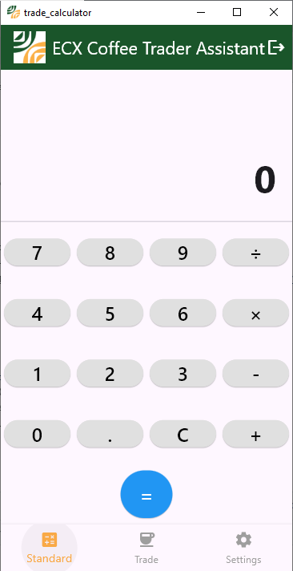
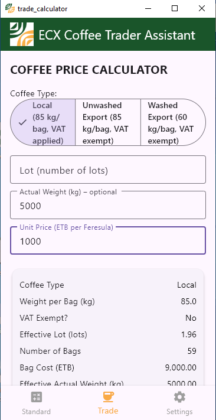
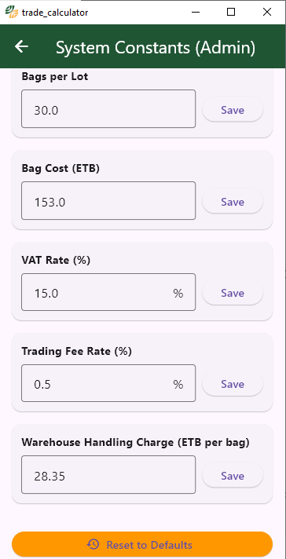

# ☕ ECX Coffee Trade Calculator

A cross‑platform Flutter application for Ethiopian coffee exporters and traders.  
It provides a **standard calculator** and a specialised **ECX trade calculator** that automatically computes bag costs, VAT, fees, and final trade values based on user inputs (Lot / Actual Weight, Unit Price) and coffee type (Local / Unwashed / Washed).  

All system constants (bags per lot, bag cost, VAT rate, etc.) are stored in a configuration table and can be updated by an **admin** without changing the code.

## 📱 Supported Platforms

- ✅ **Android** (APK, release build)
- ✅ **Windows** (desktop .exe, standalone)
- 🧪 **iOS** (sideloading with free Apple ID or TestFlight with paid developer account)

## ✨ Features

- 🔢 **Standard Calculator** – basic arithmetic (+, –, ×, ÷)
- 📊 **ECX Trade Calculator**
  - Input **Lot** **or** **Actual Weight** (kg)
  - Input **Unit Price** (ETB per Feresula)
  - Select coffee type:
    - `Local` – 85 kg/bag, **VAT applied**
    - `Unwashed Export` – 85 kg/bag, **VAT exempt**
    - `Washed Export` – 60 kg/bag, **VAT exempt**
  - Automatic calculation of:
    - Number of bags, bag cost
    - Adjusted trade value
    - VAT (15% – only for Local)
    - Standardised trade value
    - Trading fee (0.5%)
    - Warehouse handling charge (28.35 ETB/bag)
    - ECX VAT (15% on fees)
    - **Final trade value**
- 🔐 **Admin‑only settings** – password‑protected screen to edit constants (bags/lot, bag cost, VAT rate, trading fee rate, warehouse handling charge)
- 🎨 **Branding** – primary colour `#1a552a`, secondary `#f9a946`, custom app icon
- 💾 **Persistent storage** – user‑editable constants saved with `shared_preferences`

## 🖼️ Screenshots

| Standard Calculator | Trade Calculator | Admin Settings |
|---------------------|------------------|----------------|
|  |  |  |

## 🚀 Getting Started

### Prerequisites

- [Flutter SDK](https://docs.flutter.dev/get-started/install) (3.41 or later)
- For Android: Android Studio / SDK (API 24+)
- For Windows: Visual Studio with “Desktop development with C++”
- For iOS (optional): Xcode (macOS only) or use GitHub Actions for cloud builds

### Clone & Install

```bash
git clone https://github.com/AbebeTefera/trade_calculator.git
cd trade_calculator
flutter pub get
